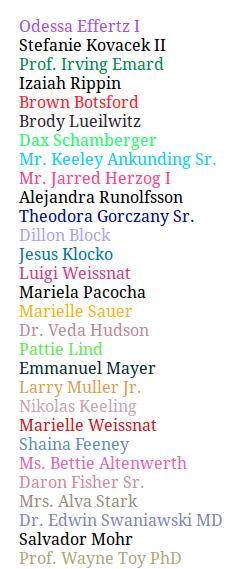

color-nick
==========

A simple PHP lib that can color nick names to make them distinguishable in a chat room.
Each color is unique to the name so each name keeps its color regardless of the time, system
or whatever circumstances. This is done using a `sha1` hash on the name and taking the first 7
characters in it hex representation to calculate the color.

[](https://packagist.org/packages/cebe/color-nick)
[](https://packagist.org/packages/cebe/color-nick)

Requirements
------------

PHP 5.4 or higher.

Installation
------------

Using [Composer](http://getcomposer.org):

    composer require cebe/color-nick

Usage
-----

```php
<?php

use cebe\colornick\Color;

require(__DIR__ . '/vendor/autoload.php');

$color = Color::calculateColor($name);
```

See [example.php](example.php) for a working example.
Here is a screenshot of the output:



License
-------

MIT, see [LICENSE](LICENSE.md) file for more details.
